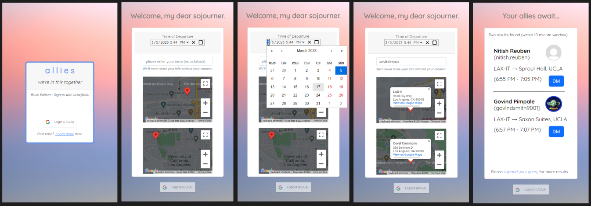

# Never fear, your allies are here! 🥳

*$130+ Uber from LAX to UCLA!?* Don't wanna pay these insane prices? ***Allies Await!***!



With Allies, you can split your rideshare fees amongst your fellow allies and save the day (and your wallets!).

Allies allows you to connect to UCLA students who are going to the same place you are. Simply sign-in with your UCLA email and enter:

* **Time and Date** (either now, or in the future)
  * For example, if my flight lands at a certain time or if the concert ends at a fixed time
* **Starting Location** (where your quest begins)
  * Use our interactive map (via the Google Maps API) to pick the exact location 
* **Ending Location** (where your quest ends) 

And voila! You will be instantly matched to other UCLA students in the same boat as you and can reach out via Instagram. 

Simply install our all-in-one app (to be released on the App Store and Play Store soon), choose your destination, provide your insta handle, and watch as Allies connects you with many more allies who are going to the same place as you! 

## Why Allies?

* **Safety in Numbers**
  * Don't feel comfortable riding in a strangers car? Get your allies to join you, with fellow Bruins you can trust!
* **Environment**
  * Less fuel spent overall when you share your ride! Safer for the planet, and safer for you! 
* **Cost**
  * Most pragmatically, your rideshare costs will cut dramatically when you have your allies by your side!😊

&nbsp;&nbsp;

## Build

### Frontend

To build the frontend, simply run the following script after cloning the repo and cd-ing into the root directory:

```bash 
cd frontend
npm install
npm start
```

### Backend

To build the backend, simply run the following script after cloning the repo and cd-ing into the root directory:

```bash 
cd backend
pip install -r requirement.txt
./setup.sh
```
